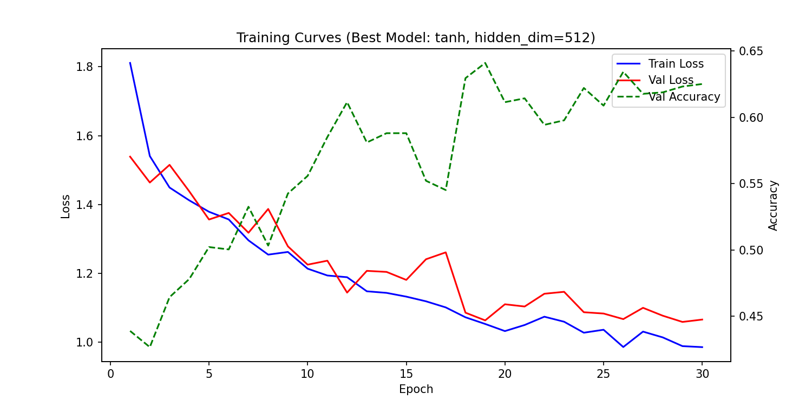
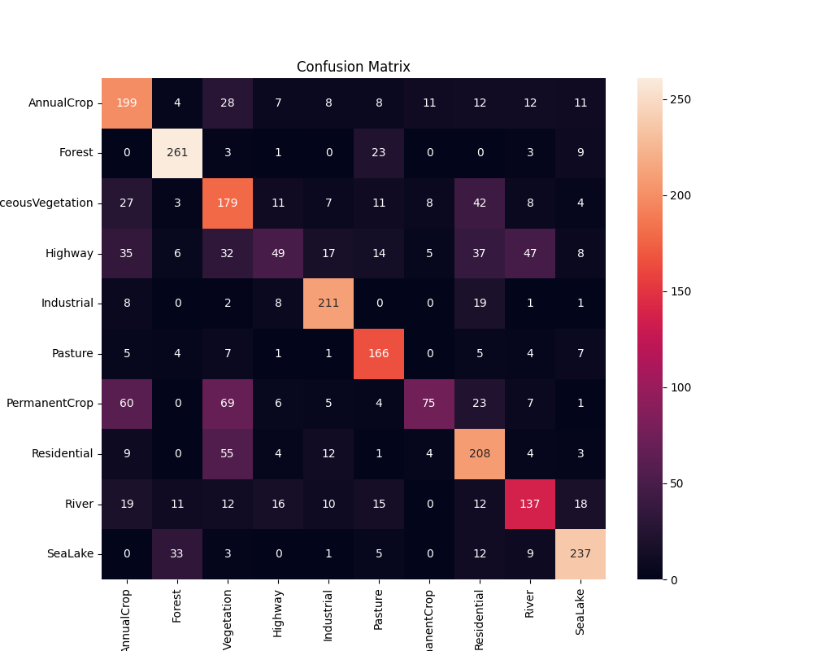
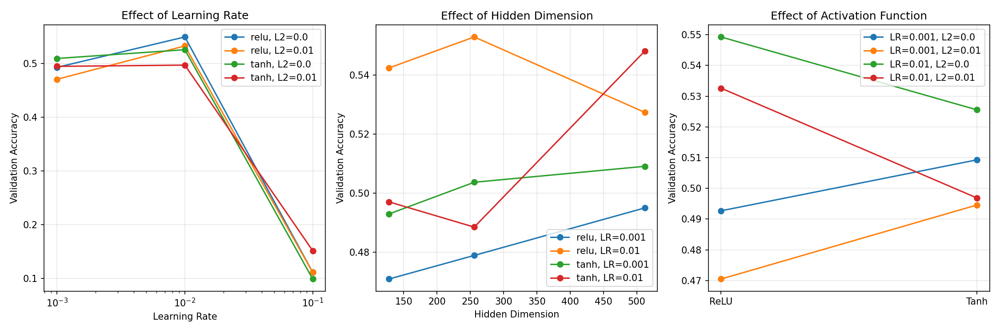
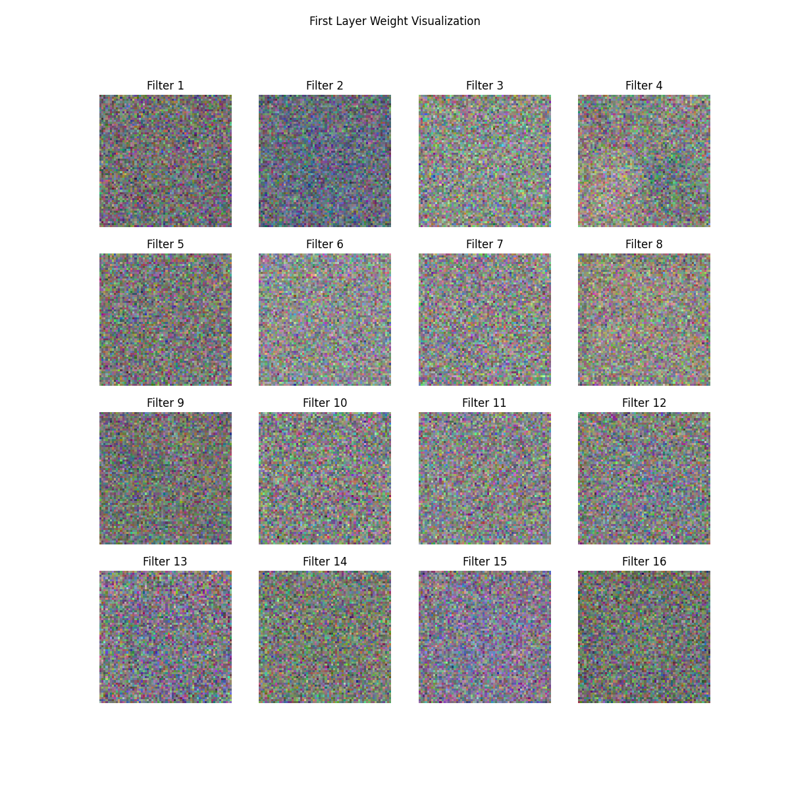
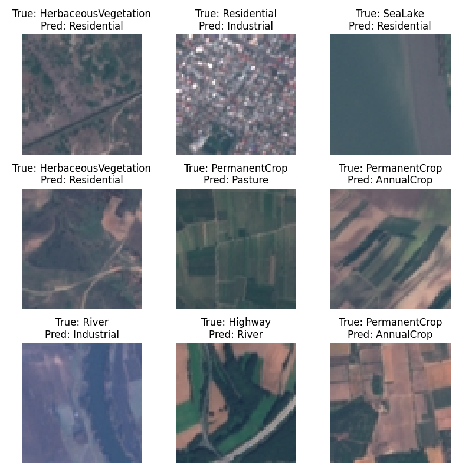

# 1. 任务概述

本次作业要求手工搭建三层神经网络（MLP）分类器，在遥感图像数据集 EuroSAT 上进行训练，实现基于卫星图像的土地覆盖分类。EuroSAT 数据集包含 10 个类别：AnnualCrop（一年生作物）、Forest（森林）、HerbaceousVegetation（草本植被）、Highway（高速公路）、Industrial（工业区）、Pasture（牧场）、PermanentCrop（多年生作物）、Residential（住宅区）、River（河流）、SeaLake（海域/湖泊）。

所有代码均使用 NumPy 实现，不依赖 PyTorch、TensorFlow 等自动微分框架，自主实现了前向传播、反向传播、优化器及损失函数。

# 2. 数据集与预处理

## 2.1 数据集概况

EuroSAT_RGB 数据集共包含 27,000 张 64×64 像素的 RGB 卫星遥感图像，分布在 10 个类别中，各类别样本数如下：

| 类别 | 样本数 | 类别 | 样本数 |
|------|--------|------|--------|
| AnnualCrop | 3,000 | Industrial | 2,500 |
| Forest | 3,000 | Pasture | 2,000 |
| HerbaceousVegetation | 3,000 | PermanentCrop | 2,500 |
| Highway | 2,500 | Residential | 3,000 |
| River | 2,500 | SeaLake | 3,000 |

## 2.2 预处理流程

1. **图像加载与尺寸统一**：使用 PIL 加载 RGB 图像，统一 resize 至 64×64。
2. **归一化**：将像素值从 [0, 255] 归一化至 [0, 1]。
3. **展平**：将每张 64×64×3 的图像展平为 12,288 维向量，作为 MLP 输入。
4. **数据划分**：按 80%/10%/10% 的比例划分为训练集（21,600）、验证集（2,700）和测试集（2,700），使用分层抽样（stratify）确保各类别比例一致。

# 3. 模型结构

## 3.1 三层 MLP 架构

模型采用经典的三层全连接网络：

```
Input (12288) → FC1 (12288→hidden_dim) → Activation1 → FC2 (hidden_dim→hidden_dim) → Activation2 → FC3 (hidden_dim→10) → Softmax
```

- **FC1**：将 12,288 维输入映射到隐藏层维度
- **FC2**：隐藏层到隐藏层的变换
- **FC3**：将隐藏层映射到 10 个类别的输出
- **激活函数**：支持 ReLU、Sigmoid、Tanh 三种选择
- **权重初始化**：采用 He 初始化（`W ~ N(0, sqrt(2/in_features))`），偏置初始化为 0

## 3.2 自主实现的关键组件

### 3.2.1 线性层（Linear）

前向传播：`y = x @ W + b`

反向传播：
- `dW = x.T @ dout`
- `db = sum(dout, axis=0)`
- `dx = dout @ W.T`

### 3.2.2 激活函数

- **ReLU**：`y = max(0, x)`，反向传播 `dx = dout * (x > 0)`
- **Sigmoid**：`y = 1/(1+exp(-x))`，反向传播 `dx = dout * y * (1-y)`
- **Tanh**：`y = tanh(x)`，反向传播 `dx = dout * (1 - y^2)`

### 3.2.3 Softmax 交叉熵损失

为数值稳定性，先对 scores 减去最大值再做 softmax：

```
shifted = scores - max(scores, axis=1)
probs = exp(shifted) / sum(exp(shifted), axis=1)
loss = -mean(log(probs[labels]))
```

反向传播梯度：`dout = (probs - one_hot(labels)) / N`

### 3.2.4 L2 正则化

在损失函数中加入权重衰减项：

```
L2_loss = 0.5 * λ * (||W1||^2 + ||W2||^2 + ||W3||^2)
```

反向传播时对 dW 加入 `λ * W` 的梯度。

## 3.3 优化器

实现了带动量的 SGD 优化器：

```
v = momentum * v + dW
W = W - lr * v
```

学习率衰减采用指数衰减策略：`lr = lr_init * exp(-decay * epoch)`

# 4. 训练配置与实验结果

## 4.1 最佳模型训练

通过超参数搜索（详见第 5 节），确定最佳配置为：

- 隐藏层维度：512
- 激活函数：Tanh
- 学习率：0.01
- L2 正则化强度：0.0
- 批大小：256
- 训练轮数：30
- 动量：0.9

## 4.2 训练过程

训练过程中训练集损失、验证集损失和验证集准确率的变化曲线如下：



从训练曲线可以观察到：

1. **训练损失**从 1.81 持续下降至 0.99，说明模型在训练集上持续学习。
2. **验证损失**从 1.54 下降至 1.06 左右后趋于平稳，训练损失和验证损失之间的差距逐渐增大，表明模型开始出现一定程度的过拟合。
3. **验证集准确率**从 43.9% 逐步提升至 64.1%（最佳），在第 19 轮达到最高后有小幅波动。

## 4.3 测试集结果

最佳模型在独立测试集上的表现为：

- **总体准确率：63.78%**

各类别的详细分类报告：

| 类别 | Precision | Recall | F1-Score | Support |
|------|-----------|--------|----------|---------|
| AnnualCrop | 0.5497 | 0.6633 | 0.6012 | 300 |
| Forest | 0.8106 | 0.8700 | 0.8392 | 300 |
| HerbaceousVegetation | 0.4590 | 0.5967 | 0.5188 | 300 |
| Highway | 0.4757 | 0.1960 | 0.2776 | 250 |
| Industrial | 0.7757 | 0.8440 | 0.8084 | 250 |
| Pasture | 0.6721 | 0.8300 | 0.7427 | 200 |
| PermanentCrop | 0.7282 | 0.3000 | 0.4249 | 250 |
| Residential | 0.5622 | 0.6933 | 0.6209 | 300 |
| River | 0.5905 | 0.5480 | 0.5685 | 250 |
| SeaLake | 0.7926 | 0.7900 | 0.7913 | 300 |

**表现较好的类别**：Forest（F1=0.84）、Industrial（F1=0.81）、SeaLake（F1=0.79）、Pasture（F1=0.74）——这些类别在视觉特征上有较强的区分性（森林的绿色纹理、工业区的灰色建筑、水域的蓝色/深色）。

**表现较差的类别**：Highway（F1=0.28）、PermanentCrop（F1=0.42）——这些类别与其他类别存在较多视觉相似性，误分类严重。

## 4.4 混淆矩阵



混淆矩阵清晰展示了各类别间的误分类模式，主要的误分类对将在第 7 节详细分析。

# 5. 超参数搜索

## 5.1 搜索空间

采用网格搜索，搜索空间如下：

| 超参数 | 搜索范围 |
|--------|----------|
| 隐藏层维度 | {128, 256, 512} |
| 学习率 | {0.001, 0.01, 0.1} |
| L2 正则化强度 | {0.0, 0.01} |
| 激活函数 | {relu, tanh} |

共 36 种组合，每种配置训练 15 个 epoch 进行快速评估。

## 5.2 搜索结果



**关键发现**：

1. **学习率的影响最为显著**：学习率为 0.1 时，所有配置的验证准确率均降至 ~10%（随机猜测水平），说明学习率过大导致训练发散；学习率为 0.001 时收敛较慢，15 epoch 内准确率仅 47-53%；学习率为 0.01 时效果最佳，达到 46-60%。

2. **隐藏层维度**：较大的隐藏维度（512）通常带来更好的性能，因为模型容量更大，能学习更复杂的特征。但差异不如学习率显著。

3. **激活函数**：在本次实验中，Tanh 在部分配置下优于 ReLU（尤其是 hidden_dim=512, lr=0.01 的最佳配置）。这可能是因为 Tanh 的零中心输出有助于后续层的优化。

4. **L2 正则化**：在本实验中，L2 正则化（λ=0.01）反而降低了性能，可能是因为 15 epoch 的训练尚不足以出现过拟合，正则化反而限制了模型学习。

## 5.3 Top-5 最佳配置

| 排名 | Hidden Dim | LR | L2 | Activation | Val Acc |
|------|-----------|-----|-----|-----------|---------|
| 1 | 512 | 0.01 | 0.0 | tanh | 60.30% |
| 2 | 256 | 0.01 | 0.01 | relu | 56.52% |
| 3 | 512 | 0.01 | 0.0 | relu | 55.52% |
| 4 | 128 | 0.01 | 0.0 | relu | 55.19% |
| 5 | 256 | 0.01 | 0.0 | relu | 54.07% |

# 6. 权重可视化与空间模式分析

## 6.1 第一层权重可视化

将训练好的模型第一层（FC1）的权重矩阵中前 16 个神经元的权重，恢复为 64×64×3 的图像进行可视化：



## 6.2 空间模式观察

从权重可视化中可以观察到以下模式：

1. **颜色模式**：部分滤波器呈现出明显的色彩倾向。例如，某些滤波器在绿色通道上响应强烈（可能与 Forest、HerbaceousVegetation、Pasture 类别相关），某些在蓝色通道上响应较强（可能与 River、SeaLake 相关），还有部分在灰色/棕色通道上响应（可能与 Highway、Industrial 相关）。

2. **空间纹理**：部分权重呈现出类似 Gabor 滤波器的条纹状模式，暗示网络在第一层学习到了检测边缘和方向性纹理的特征，这对于区分 Highway（线性结构）和 River（曲线结构）等类别可能有用。

3. **局部 vs 全局**：大多数权重呈现局部化的高亮区域而非均匀分布，表明网络倾向于关注图像中的特定区域而非全局统计，这与人类视觉系统的局部感受野机制类似。

4. **多样性**：不同滤波器呈现出不同的模式和颜色偏好，说明模型学习到了多样化的底层特征，这为后续层的组合特征提供了丰富的基础。

# 7. 错例分析



## 7.1 主要误分类模式

从混淆矩阵和错例分析中，识别出以下主要误分类对及其可能原因：

### (1) PermanentCrop → HerbaceousVegetation（69次）和 PermanentCrop → AnnualCrop（60次）

**原因分析**：多年生作物（如果园、葡萄园）在卫星图像中与草本植被和一年生作物在视觉上高度相似，均呈现绿色植被覆盖。三者主要区别在于植被的空间排列和纹理，但 64×64 的分辨率下这种差异很微弱，MLP 将图像展平后丢失了空间结构信息，使得区分更加困难。

### (2) Highway → River（47次）

**原因分析**：高速公路和河流在卫星图像中均呈现为细长的带状结构，且都可能被两侧的植被包围。从上方俯瞰时，深色的高速公路与深色的河流在颜色上也非常接近。这是本次实验中最具代表性的"视觉相似性"导致的误分类案例。

### (3) Residential → HerbaceousVegetation（55次）

**原因分析**：住宅区通常包含大量绿化带、花园和树木，在低分辨率卫星图像中，这些绿色区域可能占据相当大的比例，使得住宅区整体色调偏绿，与草本植被混淆。

### (4) Highway → Residential（37次）和 Highway → AnnualCrop（35次）

**原因分析**：高速公路周围通常有建筑物和绿化带，且高速公路本身的灰色表面与住宅区屋顶颜色相近。同时，高速公路穿过农田区域时，其与周围作物的边界在高分辨率下也不够清晰。

### (5) SeaLake → Forest（33次）

**原因分析**：部分湖泊周围被密林环绕，在 64×64 低分辨率下，水域与周围森林的边界模糊，可能导致模型倾向于将深色区域整体判为森林。

## 7.2 MLP 的局限性

通过错例分析，可以总结 MLP 在该任务上的主要局限：

1. **空间信息丢失**：MLP 将 64×64×3 图像展平为 12,288 维向量，完全丢失了像素间的空间关系（如相邻性、方向性），而很多类别的关键区分特征恰恰是空间结构（如 Highway 和 River 的带状结构）。

2. **参数量过大**：输入维度高达 12,288，第一层权重矩阵参数量极大（12,288×512 ≈ 630万），容易过拟合且训练效率低。

3. **缺乏平移不变性**：MLP 不具备卷积网络的平移不变性，同类别的不同位置出现的相同纹理无法被有效识别。

这些局限说明，对于图像分类任务，卷积神经网络（CNN）等保留空间结构的架构会有更好的表现。

# 8. 总结

本实验从零实现了一个三层 MLP 分类器，在 EuroSAT 遥感图像数据集上取得了 **63.78%** 的测试准确率。主要贡献和发现包括：

1. **自主实现**：完全使用 NumPy 实现了前向传播、反向传播、SGD 优化器（含动量）、交叉熵损失、L2 正则化和学习率衰减，未依赖任何深度学习框架。

2. **超参数搜索**：通过网格搜索发现学习率是最关键的超参数，0.01 为最优值；较大隐藏维度和 Tanh 激活函数组合效果最佳。

3. **权重可视化**：第一层权重呈现出有意义的颜色和纹理模式，表明模型学习到了与地物特征相关的底层视觉特征。

4. **错例分析**：主要误分类源于类别间的视觉相似性（如 Highway 与 River、PermanentCrop 与 HerbaceousVegetation）以及 MLP 丢失空间结构信息的固有局限。

5. **改进方向**：采用 CNN 架构保留空间信息、增加图像分辨率、使用数据增强等策略有望显著提升分类性能。

# 附录：代码结构

```
src/
├── data_loader.py        # 数据加载与预处理
├── layers.py             # 线性层、激活函数、Softmax交叉熵损失
├── model.py              # 三层MLP模型定义
├── optimizer.py          # SGD优化器（含动量和学习率衰减）
├── train.py              # 训练脚本
├── test.py               # 测试脚本
├── hyperparam_search.py  # 超参数网格搜索
└── utils.py              # 可视化工具函数
```
